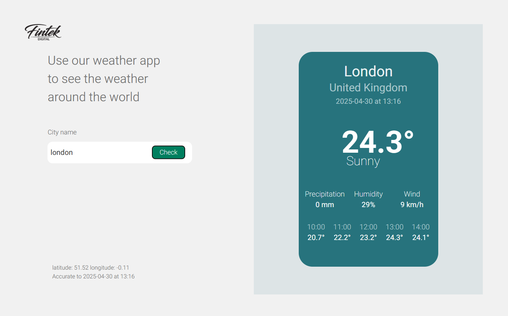

#  Weather App

This project is a **fullstack weather application** 

It includes a **React** frontend and a **Node.js** backend that fetches data from [weatherapi.com](https://www.weatherapi.com/).

---

## Preview

  

---

##  Features

- Search for a city's weather
- Fetch real-time weather data from weatherapi.com
- Responsive design for mobile, tablet, and desktop
- Accessible HTML structure with ARIA attributes and image alts


---

##  Tech Stack

- Frontend: **React**, HTML5, CSS3 (No CSS frameworks)
- Backend: **Node.js**, Express.js
- API: [weatherapi.com](https://www.weatherapi.com/)
- Font: [Heebo](https://fonts.google.com/specimen/Heebo)

---


## Installation

### Backend 
1. Clone the repository.
2. Navigate to the `server` folder.
3. Install dependencies:
   ```sh
    npm install
    ```
4. Run the development server:
   ```sh
    npm run dev
   ```
  
### Frontend
1. Clone the repository.
2. Navigate to the `client` folder.
3. Install dependencies:
   ```sh
   npm install
   ```
4. Run the development client:
   ```sh
    npm run dev 
   ```


Running the Project
After following the installation steps for both the frontend and backend, you can run the development servers for both parts of the project. Make sure to have both the frontend and backend servers running simultaneously for the project to work correctly.
